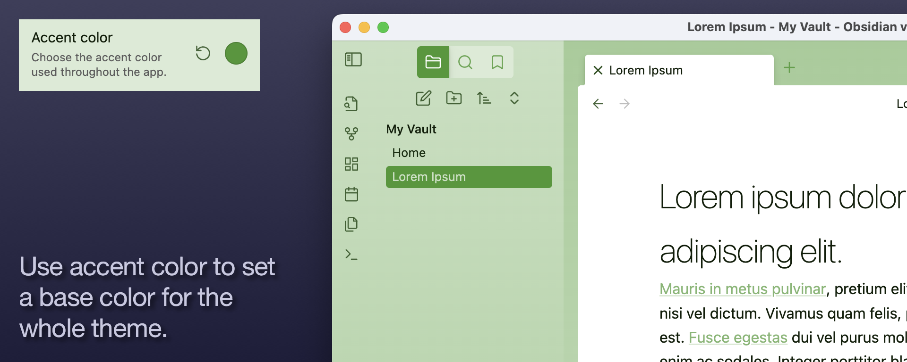
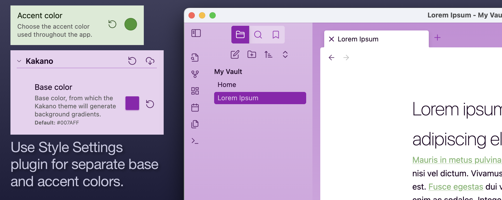
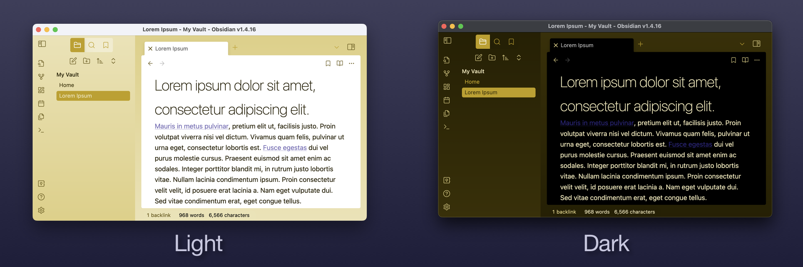
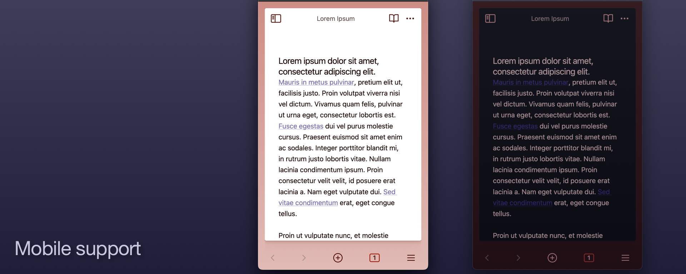
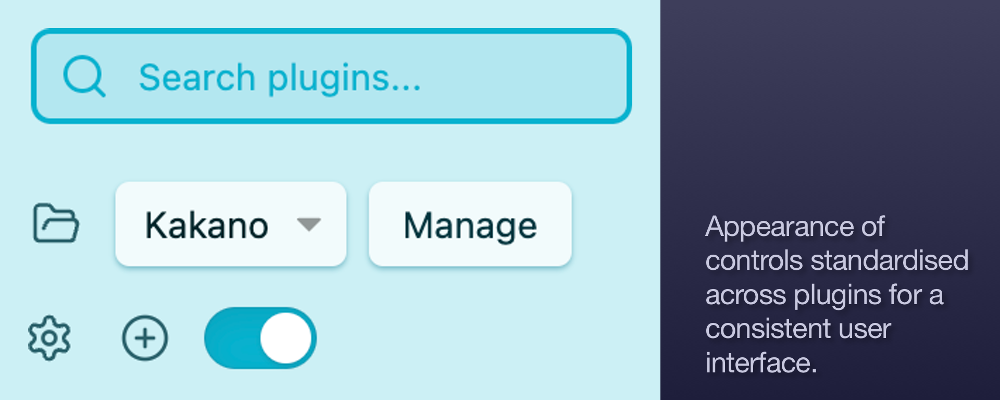
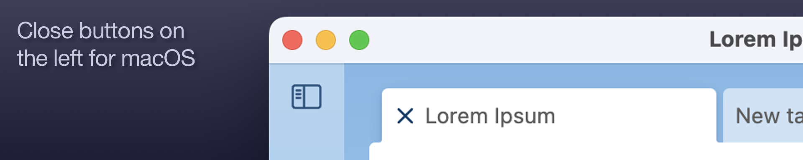
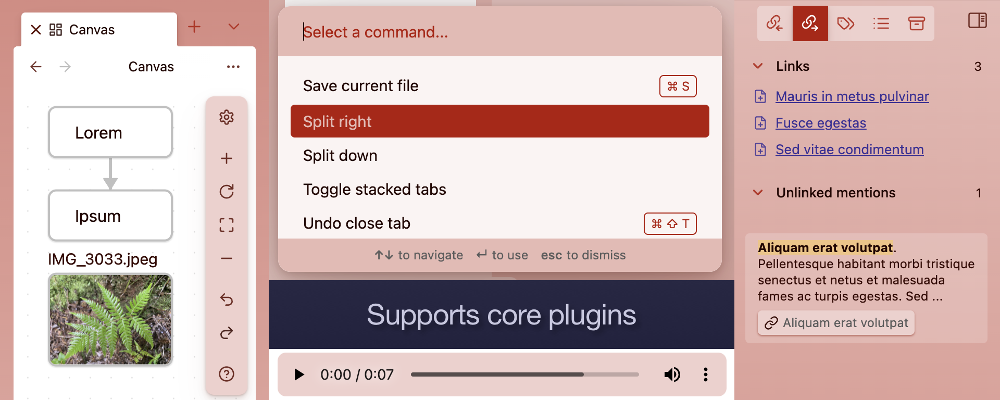

# Kakano

Kakano is an [Obsidian](https://obsidian.md/) theme with a smooth gradient background derived from a user-selected base color.

- [Kakano](#kakano)
  - [Getting started](#getting-started)
  - [Principles](#principles)
  - [Features](#features)
    - [Choose a base color](#choose-a-base-color)
    - [Light mode, dark mode, and mobile](#light-mode-dark-mode-and-mobile)
    - [Standardised controls](#standardised-controls)
    - [Properties below content](#properties-below-content)
    - [Follows OS standards by default](#follows-os-standards-by-default)
    - [Selected alternate checkboxes](#selected-alternate-checkboxes)
    - [Supports core plugins](#supports-core-plugins)
    - [And so much more](#and-so-much-more)
  - [Settings](#settings)
    - [Color settings](#color-settings)
    - [Layout settings](#layout-settings)
    - [Typography settings](#typography-settings)
    - [Editor settings](#editor-settings)
    - [Experimental settings](#experimental-settings)
  - [Plugin support](#plugin-support)
    - [Core Plugins supported](#core-plugins-supported)
    - [Community Plugins supported](#community-plugins-supported)
  - [Roadmap](#roadmap)
  - [About](#about)
  - [Credits](#credits)
  - [License](#license)
  - [Disclaimer](#disclaimer)

## Getting started

1. Install the Kakano theme
   [Open directly in Obsidian](obsidian://show-theme?name=Kakano) or open Obsidian settings and navigate to `Appearance`, then `Manage` and type "Kakano" into the `FIlter...` field. Click on `Install and use`.
2. (Recommended, but optional) Install the [Style Settings plugin](https://github.com/mgmeyers/obsidian-style-settings)
   This will give you access to some additional theme settings.
3. Set your vault's base color
   - If you're not using Style Settings, navigate to `Appearance` in the Obsidian settings, and use the `Accent color` control.
   - If you're using Style Settings, navigate to `Style Settings` in the Obsidian settings and open the `Kakano` section. Use the `Base color` control.

> [!info]
> I use Kakano with Obsidian settings that defer to OS standards:
> - Obsidian settings -> `Appearance` -> `Native menus`
> - Obsidian settings -> `Appearance` -> `Window frame style` -> `Native frame`
> I've aimed to also have it look good with other settings, but I've given more attention to this OS-native configuration.

## Principles

- **Strong color**
  Users should be able to easily select a color for each vault and have the theme generate shades and gradients automatically.
- **Help new users**
  Obsidian can be intimidating for new users. I think a good way to help with this is to clarify which parts of the window are user content (white background, strong contrast) and which are navigation and other controls (colored background, lower contrast).
- **Standardise controls**
  Obsidian’s exuberant plugin scene is fantastic, but it also means that there’s a lot of inconsistency in the design of controls and modals – even between core plugins. I’ve tried to find ways to make similar controls have similar appearance. Likewise, I’ve aimed to follow conventions from the underlying OS, such as having close controls on the left on macOS.
- **Be opinionated enough**
  I’d like Kakano to provide a great user experience by default without the user having to make any choices beyond their base color. It has settings, but I want each one to be there because different users genuinely have different needs, not just because I failed to make a decision.

## Features

### Choose a base color

Kakano starts with a user-selected base color, and generates lighter and darker versions for a cohesive overall user interface with smooth gradient backgrounds. If you reguarly use multiple vaults, set a different accent color for each to make them easy to tell apart at a glance. With Obsidian controls placed on a colored background, there's a clear visual distinction between your content and the tool you use to manage it.

> [!info]
> I use a work vault with a company brand color, and a separate green vault for my own personal notes.

- With core plugins, the base color will be your accent color.
- If the [Style Settings](https://github.com/mgmeyers/obsidian-style-settings) plugin is installed, it provides a separate Kakano base color setting, so you can have one color for your overall theme, and keep the accent color for links and tags.
- With [Style Settings](https://github.com/mgmeyers/obsidian-style-settings), there's also an option to change the level of contrast in background gradients. Set it to zero for a completely flat background color, or stronger for more dynamic range.

### Light mode, dark mode, and mobile

Supports light mode and dark mode with the same base color, on desktop and mobile.

- With [Style Settings](https://github.com/mgmeyers/obsidian-style-settings), choose whether the note background is near black or full black.

### Standardised controls

The appearance of buttons, switches, form fields and other controls is standardised across different modules, so the user interface looks and behaves consistently.

### Properties below content

Some people pay a lot of attention to propertioes on their notes, others use them occasionally. If you want them around but not in the way, Kakano let syou place them below your main note content. Currently this only works for Live Preview mode.

### Follows OS standards by default

- On macOS, close buttons appear at the left of tabs and modals, as standard.
- Kakano uses system fonts by default to be consistent with other apps. It respects user font choices if you prefer something else.

### Selected alternate checkboxes

Kakano doesn't try to support a huge range of specialised alternate checkbox marks, but focuses on the ones that are most useful in practice:
`- [/]` for "partially done"
`- [<]` for "scheduling"
`- [-]` for "cancelled"
`- [>]` for "forwarded"
`- [!]` for "important"
`- [?]` for "question"

### Supports core plugins

Kakano styles all the core Obsidian plugins.[^1]

[^1]: OK, almost all of them. I have a couple left to finish.

### And so much more
Kakano includes a lot of little details. Some notable examples are:
- Large modals are resizeable. If you change settings that affect the user itnerface, you can often resize the setting smodal to see the effects without closing it.
- When audio recording is active, the ribbon icon changes to a `REC` indicator with a pulsing red outline.

## Settings
If the [Style Settings](https://github.com/mgmeyers/obsidian-style-settings) plugin is installed, Kakano offers the following settings.
### Color settings
- **Base color**
  Sets a base color that will be used by Kakano independently of the accent color. This allows you to use one color for Kakano, and a separate color for accents in your notes. You can select from one of the preset options, or specify your own exact color.
- **Background gradient contrast**
  Adjusts the background gradient from a flat color to a strong difference between top and bottom.
- **Note backgrounds (light and dark modes)**
  The background for notes in dark mode can be either full black (nice on OLED screens) or near-black (easier on the eye).
- **Distinguish non-editable tabs**
  Use a different color for inactive tabs when they're not directly editable by the user (e.g. tabs with graphs, maps, calendar)
### Layout settings
- **Mobile horizontal spacing**
  On mobile screens where space is at a premium, there's the option to show some of the background color on each side, or to have the note go to full width.
- **Properties position**
  In Live Preview mode, properties can be positioned before (default) or after the main note content. If you rarely use properties, you may prefer to make them less prominent.
  _This setting only works for Live Preview mode. Reading mode doesn't provide suitable HTML structure to support it, and Source Mode makes properties editable within the main content area.
- **Embedded note titles**
  WHen a note is embedded in another note, the title can be shown, hidden, or shown only on hover.
### Typography settings
- **Heading scale factors**
  Rather than specify a size for every heading level independently, Kakano provides eight scale factor options that adjust the relative sizes of all heading levels together. If you like dramatic headings, the highest scale factor provides H1 headings 11 times the size of the body text, with other headings sized harmoniously in between. If you want to conserve space, the lowest setting makes H1 headings just 1.38 times the size of body text: the headings are still differentiated by size, but the ratio is smaller.
  There's a separate scale factor for phones, where space is at a premium.
### Editor settings
- **Highlight active line**
  Show a background color behind the active line while editing.

### Experimental settings
- **Embedded links scroll position**
  Embedded links can be pinned to stay on screen as a note scrolls.
- **Mobile cards UI**
  Work in progress to provide a 3D effect on mobile, with prompts and modals appearing to push the main content back when they appear in front. I'm not sure yet whether the HTML structure of Obsidian will allow me to apply this consistently, but it looks cool in the places I've tried it.
- **Full width status bar**
  Kakano moves the status bad below the main content, which looks fine provided you don't have too many items there. If it gets too wide it overlaps with the sidebars, so this setting makes space for it use the full width of the window.

## Plugin support
Kakano has specific styling for the following plugins:

### Core Plugins supported
- Audio recorder
- Backlinks
- Bookmarks
- Canvas
- Command Palette
- Files
- File Recovery
- Format converter
- Graph view
- Note composer
- Outgoing Links
- Outline
- Page Preview
- Properties view
- Quick switcher
- Random note
- Search
- Slash commands
- Slides
- Sync
- Tags view
- Templates
- Unique note creator
- Word count
- Workspaces

### Community Plugins supported
- Recent files
- Style settings
- Calendar
- Dataview
- Kanban
- Clear unused images

## Roadmap

Kakano is a one-person hobby. I'm having a great time exploring what Obsidian can do, and how far CSS has come in recent years. I want to sweat the details and apply good usability practices, but it's also something I'm doing for fun. Sometimes I'll change things on a whim, or focus on obscure areas of the UI because they present interesting challenges.

There are, however, some key areas I want to improve:

1. Support for all the core plugins. I still need to work on Publish, as I don't use it personally.
2. Support for the most popular community plugins. Currently I'm aiming at the ones with over 500K downloads.
3. Dark mode. At the moment it's mostly just an inverse of light mode, but I'd like to give it specific attention.
4. Mobile.
5. Support widely-used features from other themes. I'd like to be easy to switch to and from Kakano.

## About
I'm Isaac Freeman, a software developer in Aotearoa/New Zealand. I love to explore usability and design.

> [!tip]
> I'm currently looking for work, so let me know if you're looking for a developer in Ruby on Rails or similar web technologies.

- [Personal site](https://isaac.freeman.org.nz)
- [Github profile](https://github.com/isaacfreeman)
- [Mastodon](https://cloudisland.nz/@isaacfreeman)
- [Email](mailto:isaac@freeman.org.nz)

_Kakano_ means "color" in the Te Reo Māori – the Māori language of New Zealand.

## Credits
- [WinnerWind](https://winnerwind.github.io) suggested the Mobile horizontal spacing setting, and assisted with debugging for Windows.
- [Ryan Johnson](linkedin.com/in/rydavjohnson) suggested the setting to hide titles for embedded notes, and the ability to pin embdded backlinks.
- The[MagicUser](https://github.com/drbap/magicuser-theme-for-obsidian) theme by [Bernardo Pires](https://github.com/drbap) provided the idea of making selected modals resizeable.

## License
Kakano is licensed under the MIT License which allows you to modify and redistribute the code, however you must preserve the copyright and license notice in your CSS file. This includes any code you may extract as standalone snippets.

## Disclaimer
Kakano theme is provided as is, as a one-person hobby project I work on in my spare time. I use it on macOS and iOS, and it's not tested on other platforms. I always appreciate bug reports and suggestions, and I'll endeavour to fix problems as I hear of them, and as time permits.

There are great themes for Obsidian that provide detailed settings for many aspects of the user interface, but the path I'm taking here is to reduce the number of choices users need to make. I enjoy and appreciate feedback and suggestions from users, but I may decide that some good ideas aren't Kakano ideas.

Some of the choices I've made in Kakano may not be compatible with future updates to Obsidian, nor with custom CSS snippets. I'm aiming to keep it up to date but again, no promises.
